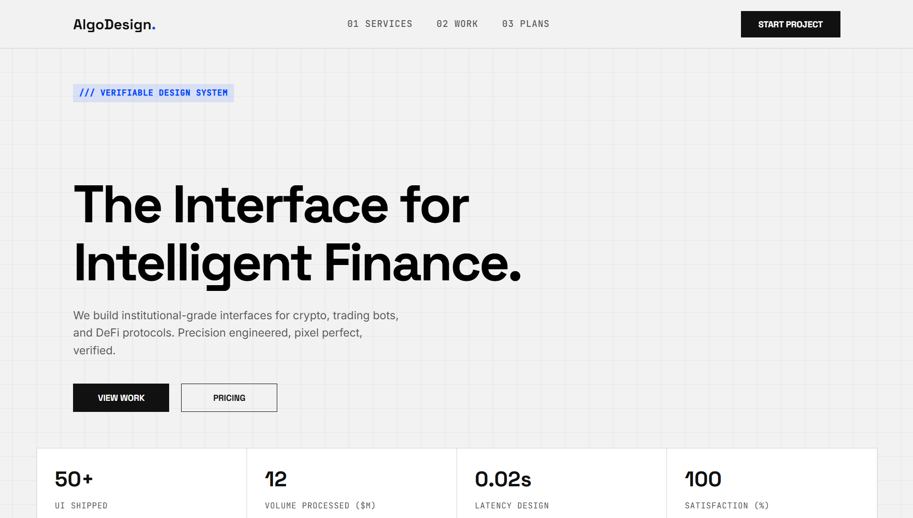

# AlgoDesign - Verifiable UI for Finance



> **AlgoDesign** is a high-fidelity frontend portfolio project simulating a niche UI/UX agency for Fintech, DeFi, and Trading platforms. It demonstrates a complete **Client-to-Admin** workflow using purely static technologies (HTML/CSS/JS) with Client-Side persistence.


## 🚀 Key Features

### 1. 🌐 Landing Page (`index.html`)
- **Immersive UX:** Custom smooth page transitions (Fade/Zoom effects).
- **Interactive Elements:** Scramble text effects and scroll-triggered animations.
- **Visitor Counter:** Tracks unique page loads to calculate conversion rates dynamically.

### 2. 📝 Order & Payment Flow (`order.html`)
- **Multi-step Form:** Seamless transition from data entry to invoice summary.
- **Client-Side Validation:** Prevents submission without required fields or files.
- **Base64 Image Processing:** Converts uploaded payment proofs into Base64 strings to simulate file storage within the browser.
- **Toast Notifications:** Custom-built notification system (replacing default alerts) for a premium feel.

### 3. 🛡️ Admin Dashboard (`admin.html`)
- **Simulated Backend:** Uses `localStorage` to persist orders, client data, and visitor stats.
- **Real-time Analytics:** - **Revenue Calculator:** Automatically sums up total order value.
- **Order Management:** Approve orders (change status to "Verified") or Delete records.
- **Proof Viewer:** Modal popup to view the actual uploaded payment proof (image) without leaving the dashboard.

## 📂 Project Structure

```bash
├── index.html      # Landing Page (Visitor entry point)
├── order.html      # Order Form & Invoice System
├── admin.html      # Admin Dashboard (Protected/Internal view)
├── style.css       # Global Styles, CSS Variables, & Animations
├── script.js       # Shared logic
└── img/            # Assets (Portfolio screenshots)
